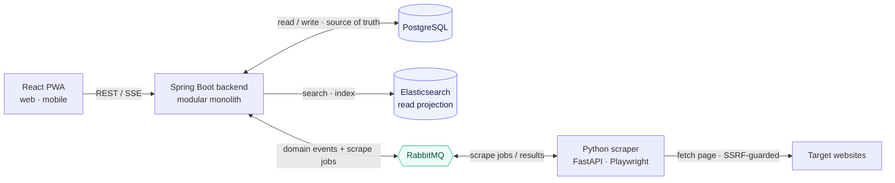
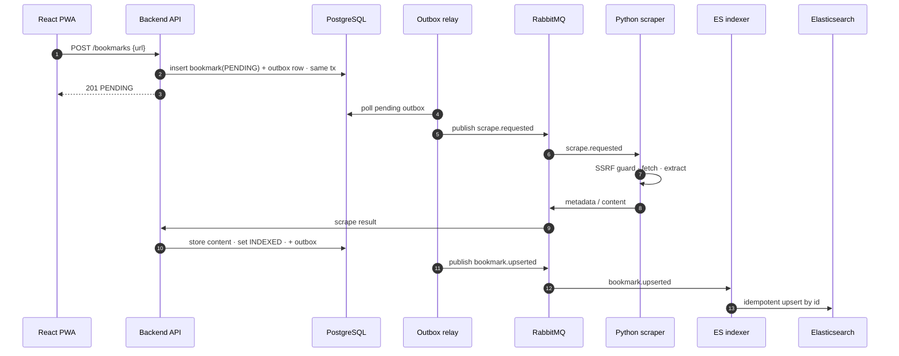
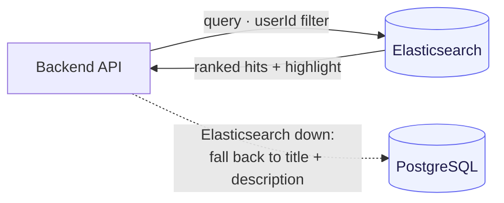

# markit

**Find the link by what's written inside it.**

markit is a centralized bookmark manager whose search reaches into the *content* of every page you
save. When you add a link, a scraping service fetches the page and indexes its text — so later you
can find a bookmark by a phrase from inside the article, not just its title or URL. The content is
used only to locate the right link; there is no reader or rendering, which keeps storage lean.

It is built as a small distributed system on purpose: a Java backend as the source of truth, a
Python scraping service, and an Elasticsearch read projection kept in sync through a transactional
outbox — with the correctness, idempotency, and observability that pattern demands.

---

## The problem it solves

Traditional bookmark managers search only titles and URLs. People forget titles but remember what a
page *said*. markit makes the content itself searchable:

- Organize links as **Collection → Category → Bookmark**.
- Paste a URL; the title fills in automatically and the page text is indexed in the background.
- Search across **title, description, and full page content**, with the matching snippet highlighted.
- Partial (prefix) matching from three characters — `rel` finds *reliability*.

---

## Engineering highlights

- **Content-aware search** over an Elasticsearch projection, with **graceful degradation**: if
  Elasticsearch is down, search falls back to a Postgres title/description query instead of failing.
- **Transactional outbox → RabbitMQ → Elasticsearch** sync: the state change and its event commit in
  a single database transaction (no dual write); a polling relay ships it at-least-once; an idempotent
  indexer makes it **effectively-once**, with ordered per-aggregate processing and a dead-letter path.
- **Polyglot, decoupled scraping**: a Python service does two-phase extraction (fast metadata, then
  full content via *trafilatura* with a **Playwright headless fallback** for JS-heavy pages), behind a
  **fail-closed SSRF guard** (DNS-resolve + private/metadata-range deny-list, redirect re-validation,
  content-type allowlist, size cap).
- **End-to-end distributed tracing**: one add→scrape→index flow is a single trace across
  Java → RabbitMQ → Python → RabbitMQ → Java → Elasticsearch (OpenTelemetry → Jaeger).
- **Per-user isolation** enforced on every query and proven by an authorization-matrix test; RFC 7807
  error model; JWT access + rotating refresh tokens; Argon2id password hashing.
- **DDD / hexagonal** modular monolith — the domain layer is framework-free, enforced in CI by ArchUnit.

---

## Architecture

Polyglot by design: the Spring Boot backend owns PostgreSQL (source of truth); Elasticsearch is a
disposable read projection; the Python scraper is the only egress to the web, decoupled over RabbitMQ.



---

## How it works

Adding a bookmark is asynchronous. The write path never blocks on the scraper: the bookmark is
created immediately as `PENDING`, and the title and content stream in afterwards. The state change and
its outbox event are committed together, so the pipeline is reliable even if the broker or scraper is
temporarily down.



Search queries Elasticsearch, always scoped to the requesting user. If Elasticsearch is unavailable,
the query degrades to a cheap Postgres title/description search rather than returning an error.



---

## Tech stack

| Layer | Choice |
|---|---|
| Backend | Java 21 · Spring Boot 3.4 (modular monolith, DDD / hexagonal) |
| Scraper | Python · FastAPI · trafilatura · Playwright |
| Source of truth | PostgreSQL 16 (Flyway migrations) |
| Search | Elasticsearch 8 (read projection) |
| Messaging | RabbitMQ (event backbone + scrape dispatch) |
| Frontend | React · TypeScript · Vite · PWA (optimistic UI, SSE) |
| Observability | Micrometer · Prometheus · OpenTelemetry · Jaeger · Grafana |
| Testing | JUnit 5 · Testcontainers · ArchUnit · Playwright · pytest |

---

## API

Base path `/api/v1`. JSON over HTTPS; JWT bearer on everything except `/auth/*`. Every request is
scoped to the authenticated user; errors follow RFC 7807 `application/problem+json`.

| Area | Endpoints |
|---|---|
| **Auth** | `POST /auth/register` · `POST /auth/login` · `POST /auth/google` · `POST /auth/refresh` · `POST /auth/logout` · `GET /me` |
| **Collections** | `GET /collections` (`?expand=categories`) · `POST /collections` · `PATCH /collections/{id}` · `DELETE /collections/{id}` · `PUT /collections/reorder` |
| **Categories** | `GET /collections/{id}/categories` · `POST /collections/{id}/categories` · `PATCH /categories/{id}` · `DELETE /categories/{id}` · `PUT /collections/{id}/categories/reorder` |
| **Bookmarks** | `GET /categories/{id}/bookmarks` · `POST /categories/{id}/bookmarks` · `GET /bookmarks/{id}` · `PATCH /bookmarks/{id}` · `DELETE /bookmarks/{id}` · `POST /bookmarks/{id}/rescrape` |
| **Search** | `GET /search?q=&categoryId=&limit=&cursor=` |
| **Live status** | `GET /events` — Server-Sent Events stream of a bookmark's `PENDING → INDEXED / FAILED` lifecycle |

---

## Observability

All three signal types, wired end to end:

- **Logs** — structured JSON with a correlation/trace id on every request and every async hop.
- **Metrics** — instrumented per logical component using the RED (request-shaped) and USE
  (resource-shaped) frameworks on top of the free Micrometer meters, plus domain metrics that only
  mean something here: outbox lag, dead-letter depth, projection freshness, scrape success/tier ratio,
  degraded-search rate. Exposed to Prometheus; visualized in a provisioned Grafana dashboard with
  alert rules on the crown-jewel signals.
- **Traces** — OpenTelemetry propagates a W3C `traceparent` through RabbitMQ so the whole async
  pipeline is a single, navigable trace in Jaeger.
- **Health** — production-grade liveness/readiness probes; Postgres is essential, Elasticsearch and
  RabbitMQ are treated as degradable.

---

## Testing

A behavior-focused pyramid, with the crown-jewel paths covered deepest:

- **Unit** — domain invariants and application services (no framework); the outbox relay's ordering
  and dead-lettering; the indexer's idempotency; the SSRF guard's deny-list.
- **Architecture** — ArchUnit enforces that the domain layer imports no framework/infrastructure.
- **Integration** — Testcontainers (Postgres + Elasticsearch + RabbitMQ) drive the real pipeline:
  a bookmark is projected into Elasticsearch, a delete removes it, re-delivery converges to one
  document, and the cross-user authorization matrix returns 404 on foreign resources.

---

## Running locally

Requires Docker.

```bash
cd deploy
docker compose up --build
```

This starts Postgres, Elasticsearch, RabbitMQ, Jaeger, Prometheus, Grafana, the backend, and the
scraper. Then:

```bash
# backend: fast unit + architecture tests
cd backend && mvn test
# backend: full verify incl. Testcontainers integration tests
cd backend && mvn verify
# scraper
cd scraper && pytest
```

- API health: `http://localhost:8080/actuator/health`
- Traces: `http://localhost:16686` (Jaeger) · Metrics: `http://localhost:9090` (Prometheus) ·
  Dashboards: `http://localhost:3000` (Grafana)

---

## Roadmap

- **Manual tags → automatic tagging.** Bookmarks carry a tag vocabulary; the plan is to derive tags
  automatically from the scraped content with an LLM (a local model via Ollama, or a hosted one). The
  event backbone already lets a tagging consumer subscribe to the same content events the indexer
  uses, so it slots in without touching the write model.
- **Trash.** Soft-delete with a 30-day retention window and restore, replacing today's hard delete —
  the sync path already treats deletes idempotently, so this is a `deleted_at` column plus a scheduled
  purge.
- **Bulk import.** Import an existing browser bookmarks HTML export in one pass.

---

## Project structure

```
backend/    Spring Boot modular monolith — bounded contexts: identity · bookmarking · scraping · search · shared
scraper/    Python FastAPI scrape worker — SSRF guard, two-phase extraction, RabbitMQ consumer/publisher
frontend/   React + TypeScript PWA — optimistic UI, SSE, content-search
deploy/     docker-compose stack, Prometheus/Grafana config, backup & restore tooling
```
